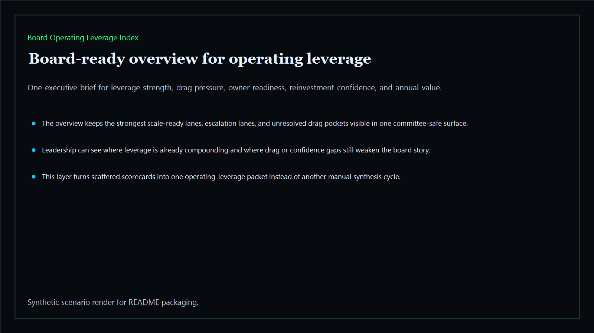
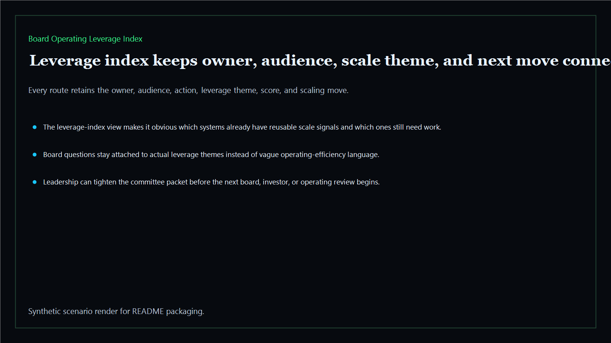
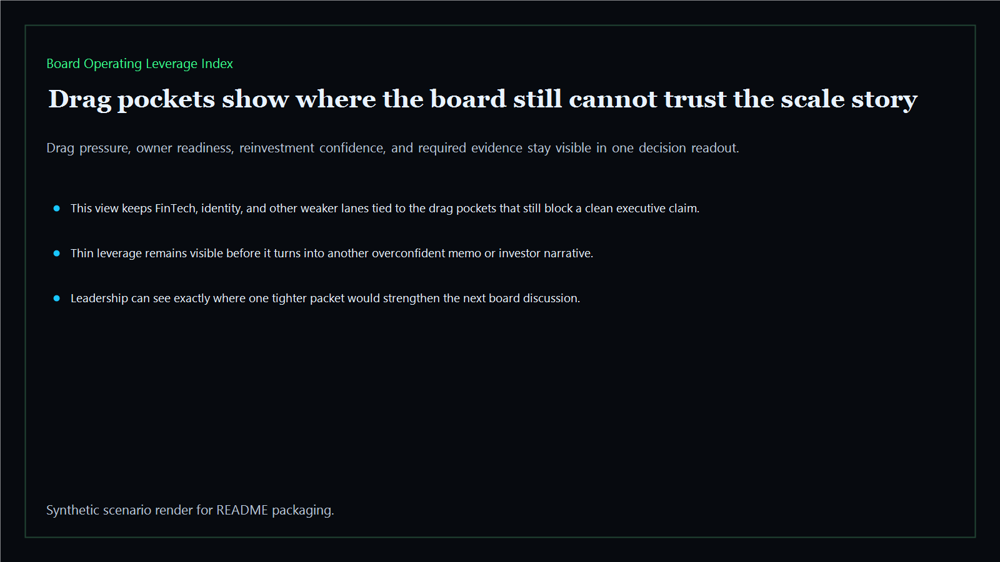
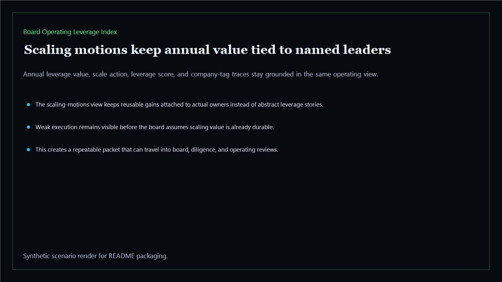

# Board Operating Leverage Index

Board-ready operating leverage index for scaling motions, drag pockets, owner readiness, and reinvestment confidence across the executive estate.

- Live: `https://leverage.kineticgain.com/`
- Repo: `mizcausevic-dev/board-operating-leverage-index`

## Why this matters

Leaders need more than isolated savings wins. They need one leverage index that shows what scales, where drag still sits, which owners are ready to expand the gains, and where reinvestment confidence is still too thin for the board to trust.

## What it includes

- TypeScript executive-intelligence surface for operating leverage with modeled scaling signals, drag pressure, ownership readiness, and reinvestment confidence
- synthetic executive lanes across AI, identity, revenue, FinTech, biotech, procurement, and public-sector readiness
- reusable outputs for leverage indexes, drag-pocket packets, scaling-motion views, and board-ready operating maps
- prerendered static site, JSON payloads, screenshots, and docs

## Routes

- `/`
- `/leverage-index`
- `/drag-pockets`
- `/scaling-motions`
- `/verification`
- `/docs`

## Local run

```bash
cd board-operating-leverage-index
npm install
npm run verify
npm run prerender
npm run render:assets
```

## CLI

```bash
npx board-operating-leverage-index fixtures/board-operating-leverage-index.json --format summary
npx board-operating-leverage-index fixtures/board-operating-leverage-index-clean.json --format json
```

## Docs

- [Architecture](docs/architecture.md)
- [Origin](docs/ORIGIN.md)
- [Kinetic Gain Embedded](docs/KINETIC_GAIN_EMBEDDED.md)

## Screenshots






